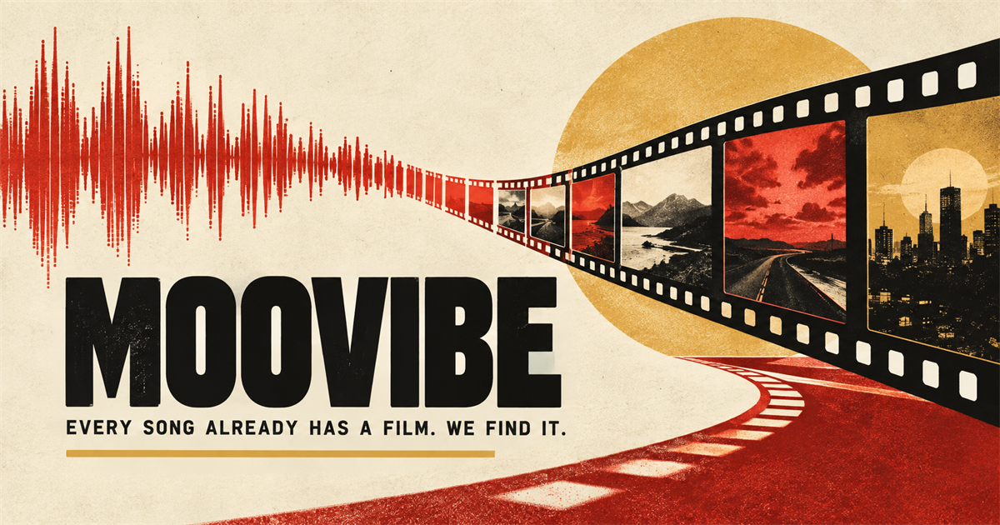

<p align="center">
  
  
  
  
  
</p>

# 🎬 Moovibe

**Uma ponte entre música e cinema.** Informe de uma a três músicas e o Moovibe procura, em seu próprio catálogo, um filme que compartilhe a atmosfera emocional e estética delas.

> 🚀 **[Teste agora — moovibe.pages.dev](https://moovibe.pages.dev/)**



## ✨ O que é o Moovibe?

O Moovibe é uma experiência de descoberta cinematográfica guiada por música. Ele reúne letra, contexto e identidade sonora das faixas escolhidas para compreender sentimentos, temas, ritmo e estética — e então encontra filmes que vivem em uma vibração parecida.

O sistema **não pede a uma IA que invente um título**. A busca acontece dentro de uma biblioteca cinematográfica própria: primeiro algoritmos recuperam e ranqueiam candidatos reais; só no fim o Gemini atua como curador, escolhendo um filme principal e duas alternativas entre os finalistas permitidos.

## 🎵 Como funciona para quem usa

1. Escolha entre uma e três músicas com o autocomplete.
2. O Moovibe reúne letra e contexto das faixas.
3. A aplicação encontra uma recomendação principal e duas alternativas.
4. O resultado traz pôster, sinopse, justificativa da conexão, capa e prévia das músicas e links para TMDb, IMDb e Letterboxd.
5. A recomendação pode ser compartilhada e também passa a integrar o Hall da Fama.

A interface funciona em oito idiomas — português do Brasil, inglês, chinês simplificado, russo, espanhol, alemão, francês e japonês — e mantém o fluxo simples: música primeiro, cinema depois.

## 🧠 Como a recomendação funciona

Cada busca é transformada em duas representações complementares:

```text
música(s)
   ↓
letra + contexto
   ↓
perfil emocional e estético
   ├── 10 dimensões de vibe, entre 0 e 1
   └── embedding semântico de 768 dimensões
```

Os filmes enriquecidos do catálogo possuem a mesma linguagem emocional. O recomendador consulta dois canais em paralelo:

- **Canal semântico:** o Cloudflare Vectorize recupera os 100 filmes semanticamente mais próximos.
- **Canal numérico:** o D1 compara matematicamente as dez dimensões de vibe e recupera outros 100 candidatos.

Depois, o sistema faz `union` e deduplicação, aplica um score híbrido com sinais numéricos, semânticos, conceituais e de qualidade, promove uma diversificação suave e mantém até 100 finalistas. O Gemini recebe somente esse conjunto e escolhe **um filme principal + duas alternativas**. IDs externos ao catálogo são rejeitados.

```text
Vectorize top 100 ─┐
                   ├─ union/dedupe → score híbrido → diversificação → até 100 candidatos
D1 numérico top 100┘                                             ↓
                                                    Gemini como curador final
```

## 🎞️ Um catálogo vivo

A biblioteca do Moovibe cresce de forma autônoma. Um Worker agendado descobre filmes no TMDb e distribui etapas pequenas e retomáveis pela Cloudflare Queue:

```text
TMDb → discovery contínuo → fetch → enrichment → embedding → Vectorize
```

- **Discovery** percorre recortes por país, gênero, década e lançamentos recentes.
- **Fetch** coleta fatos e relações cinematográficas no TMDb.
- **Enrichment** descreve a linguagem emocional e estética do filme em dados estruturados.
- **Embedding** cria sua representação semântica de 768 dimensões.

Quando esse fluxo termina, o filme passa a competir automaticamente nas próximas recomendações. D1 guarda o catálogo normalizado e os checkpoints; Vectorize mantém o índice semântico; a Queue permite retries e recuperação sem transformar a coleta em uma execução monolítica.

## ✨ Funcionalidades

- Busca com **uma a três músicas**.
- Autocomplete de faixas via LRCLIB.
- Análise de letra e contexto musical com fontes e fallbacks reais.
- Capa do álbum e prévia de áudio, quando disponíveis.
- Recomendação principal com justificativa focada no filme escolhido.
- Duas alternativas cinematográficas.
- Links para TMDb, IMDb e Letterboxd.
- URLs compartilháveis com Open Graph dinâmico.
- Hall da Fama das recomendações.
- Interface localizada em oito idiomas.
- Letras obrigatórias com catálogo musical persistente, perfis e embeddings reutilizáveis.
- Observabilidade administrativa privada e sem rastreamento invasivo.
- Catálogo cinematográfico próprio, crescente e pesquisável por dois canais.

## 🏗️ Arquitetura

```text
Navegador
  └─ HTML/CSS/JavaScript
       └─ Cloudflare Pages Functions
            ├─ fontes musicais (LRCLIB, Genius e fallbacks)
            ├─ Gemini: perfil, embedding de busca e curadoria
            ├─ D1: candidatos numéricos e dados dos filmes
            ├─ Vectorize: candidatos semânticos
            └─ KV: cache, histórico e compartilhamentos

Cloudflare Cron
  └─ Worker de pipeline
       └─ Queue → discovery → fetch → enrichment → embedding
                    ├─ TMDb
                    ├─ D1
                    └─ Vectorize
```

O frontend e o contrato público continuam nas Pages Functions. O pipeline assíncrono roda separadamente no Worker, evitando que a manutenção do catálogo bloqueie uma recomendação feita por uma pessoa.

## 🛠️ Tecnologias

| Tecnologia | Papel no projeto |
| --- | --- |
| HTML, CSS e JavaScript | Interface web existente e experiência SPA |
| Cloudflare Pages + Pages Functions | Hospedagem e API do recomendador |
| Cloudflare Workers + Queues | Agendamento e processamento resiliente do catálogo |
| Cloudflare D1 | Biblioteca normalizada, estados e ranking numérico |
| Cloudflare Vectorize | Busca semântica dos filmes |
| Cloudflare KV | Cache, histórico e links compartilhados |
| Gemini | Perfis estruturados, embeddings e curadoria restrita |
| TMDb | Filmes, imagens, créditos e metadados factuais |
| LRCLIB e Genius | Letras, autocomplete e contexto musical |
| DuckDuckGo, Wikipedia e Brave Search | Fallbacks de contexto |
| Apple/iTunes, Deezer e MusicBrainz | Capas e prévias de áudio |

## 💻 Desenvolvimento local

Requisitos: Node.js 20+; Python é necessário apenas para ferramentas locais legadas.

```bash
npm install
copy .dev.vars.example .dev.vars
npm run db:migrate:local
npm run check
npm run worker:dev
npm run pages:dev
```

Em Linux ou macOS, use `cp .dev.vars.example .dev.vars`. Preencha apenas o arquivo local; `.dev.vars` e `.env` não devem ser commitidos.

## ☁️ Infraestrutura e deploy

O projeto usa recursos Cloudflare já nomeados: Pages `moovibe`, D1 `moovibe-library`, Vectorize `moovibe-movies-v1`, Queue `moovibe-pipeline` e sua DLQ. Antes de qualquer alteração remota, confira o ambiente existente:

```bash
npm run cloud:check
npm run pages:config:download
```

O schema vive em `migrations/`. Os comandos de produção são intencionalmente separados:

```bash
npm run db:migrate       # aplica migrações D1
npm run worker:deploy    # pipeline assíncrono
npm run pages:deploy     # frontend e Pages Functions
```

Pages e Worker são serviços diferentes e precisam dos bindings compatíveis para D1 e Vectorize. O KV `MOOVIBE_DB` continua responsável por cache, histórico e compartilhamentos. Nunca grave chaves no Git; use secrets do Cloudflare para Gemini, TMDb, Genius, Brave e endpoints administrativos conforme necessário.

Para acompanhar o pipeline:

```bash
npm run worker:tail
```

Os logs estruturados mostram jobs, queries, progresso de páginas, retries e conclusão. O endpoint autenticado `/admin/status` resume catálogo e backlog sem retornar secrets.

## 📄 Licença

O Moovibe é disponibilizado sob a licença MIT.
